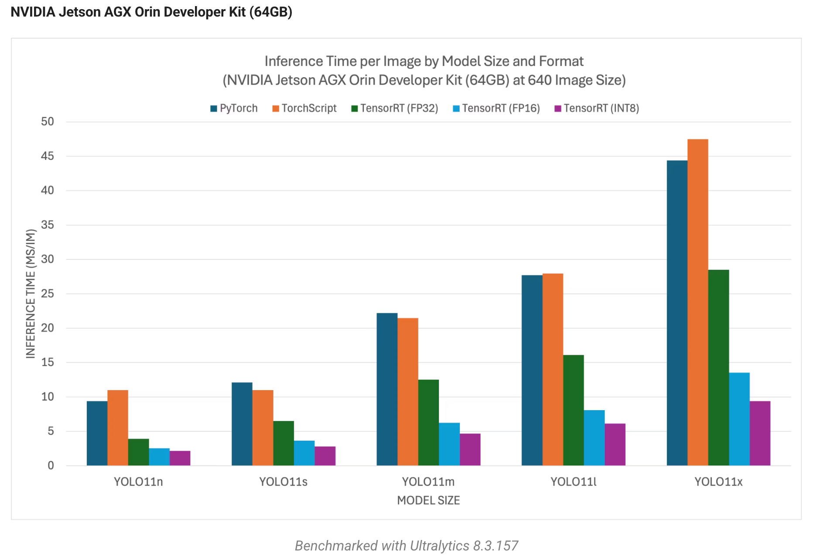
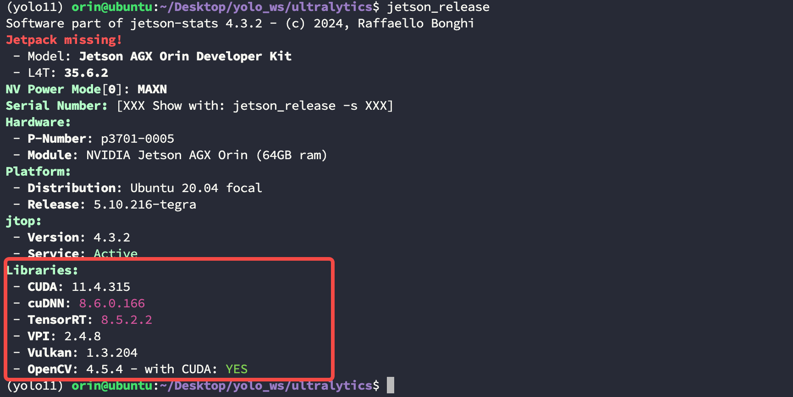
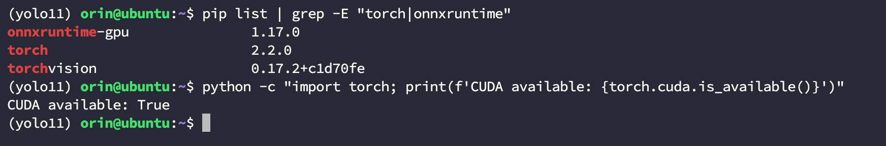
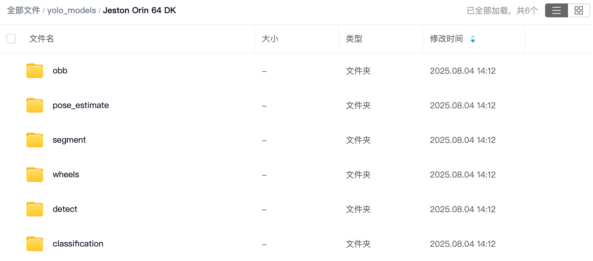
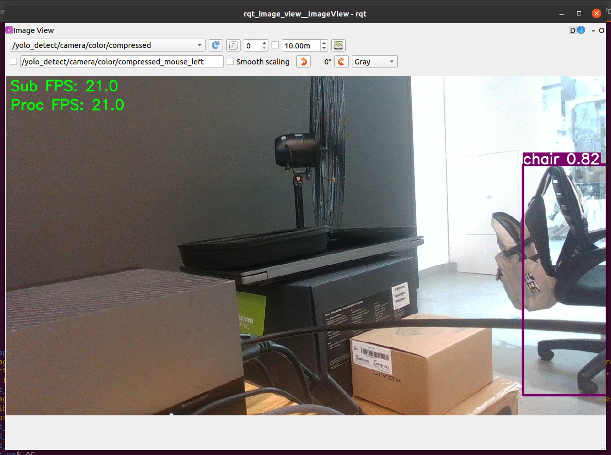
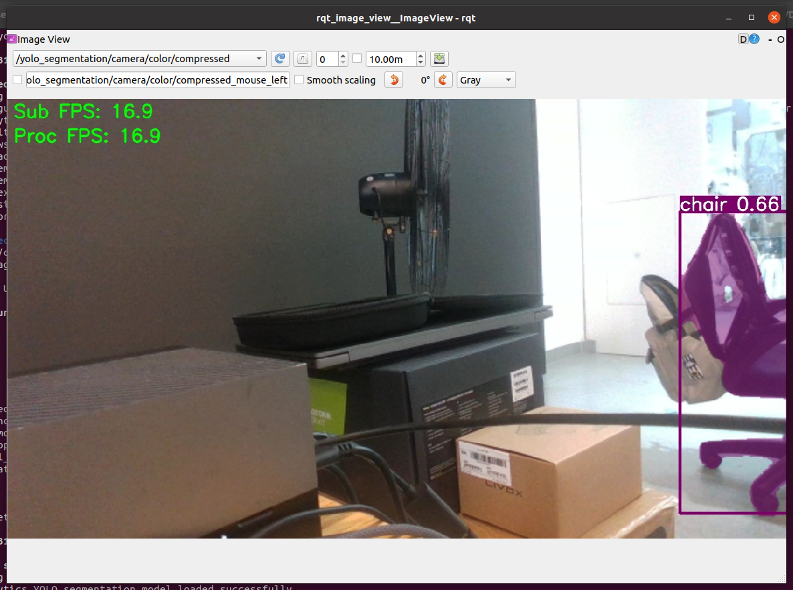
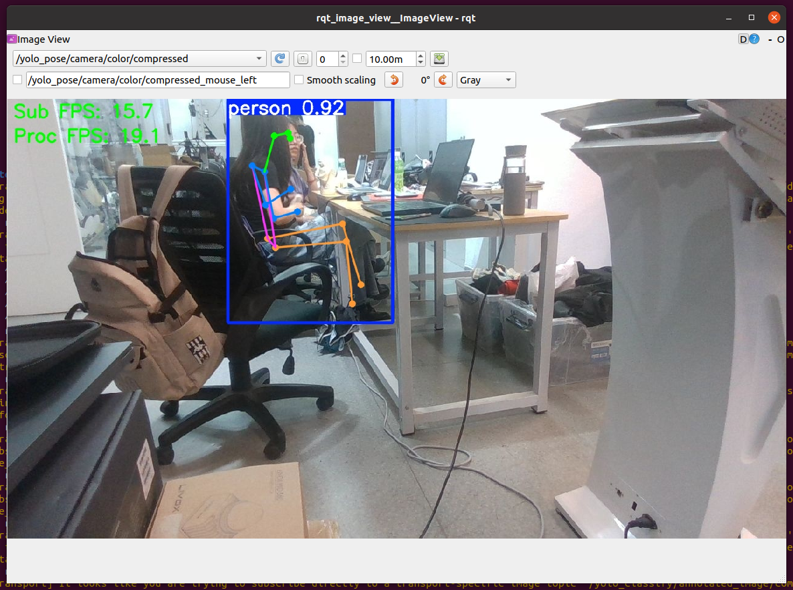

# Jeston Yolo ROS

这个包是在 Nvidia Orin 上运行 Yolov11 模型，包含了五个基础功能节点：目标检测、语意分割、图像分类、姿态估计、OBB计算。

以下是这个仓库参考的博客与链接：

* Ultralytics：[https://github.com/ultralytics/ultralytics](https://github.com/ultralytics/ultralytics)
* Ultralytics Nvidia Jetson：[https://docs.ultralytics.com/guides/nvidia-jetson/#install-pytorch-and-torchvision_1](https://docs.ultralytics.com/guides/nvidia-jetson/#install-pytorch-and-torchvision_1)

【Note】如果你的设备是一台全新的 Nvidia Orin，建议参考下面的博客进行刷机，并且按照 `【15. [可选] 安装 Yolo11 与 DeepStream】` 章节完成安装，这样可以跳过下面的 `【Install Ultralytics】` 章节内容；

* Nvidia Orin DK 刷机：[https://blog.csdn.net/nenchoumi3119/article/details/149779298?spm=1001.2014.3001.5502](https://blog.csdn.net/nenchoumi3119/article/details/149779298?spm=1001.2014.3001.5502)


<font color=red>**建议在你的环境中安装好 conda 以管理 python 虚拟环境。**</font>


编译好的模型和部分轮子资源可以通过下面的链接从网盘中：

```txt
https://pan.baidu.com/s/1pxzS423gZaWbsfSmpQGrsQ?pwd=24wj
```

---
# 贡献者

该工程由 `中国科学院自动化研究所` 提供硬件与测试场地，同时以下人员在该项目的开发中做出了巨大贡献，在此感谢他们的付出：

[WenJiang Xu 徐文江](https://github.com/HEA1OR)，[PengFei Yi 易鹏飞](https://github.com/alfie010)，[JingKai Xu 徐靖凯](https://github.com/Triumphant-strain)，[XingYu Wang 王行宇](https://github.com/xywang227)，[YaNan Hao 郝亚楠](https://github.com/haoyanan2024)，[YuWei Wang 王雨薇](https://github.com/YuweiWang2002)


----
# News & Future Work

* 2025年08月04日：完成仓库初始化；

* Target：添加 Yolo 3D 部分；

----
#  软硬件确认

请先确认你的软硬件配置是否与通过测试的列表一致：

|Device|OS|Platform|JetPack|CUDA|OpenCV|ROS|
|--|--|--|--|--|--|--|
|Nvidia Orin 64 GB DK|Ubuntu 20.04|Arm64|5.1.3|11.4.315|4.5.4 with CUDA|Noetic|

Ultralytics 官网中 [NVIDIA Jetson AGX Orin Developer Kit (64GB)](https://docs.ultralytics.com/guides/nvidia-jetson/#nvidia-jetson-agx-orin-developer-kit-64gb) 章节给出了一个不同模型的性能对照表，该表可以作为检测环境是否配置正确的依据，如果你最终的效果和这张表相差过大，请检查的你的 CUDA 与 TensorRT 是否配置正常：



Orin 设备可以通过下面的命令查看当前 CUDA 与 TensorRT 版本：

```bash
$ jetson_release
```



----
# Step1. 安装并配置 Ultralytics

如果你在此之前没有安装过 Ultralytics 环境，首先应该执行下面的步骤，如果你已经在本地部署了 Ultralytics 环境那么可以跳过这一章节，但需要确保你的环境中 `torch`、`torchvision`、`onnxruntime` 是 GPU 加速的版本，通过下面的命令查看（假设你的conda环境名为 `yolo11`）：

```bash
(base) $ conda activate yolo11
(yolo11) $ pip list | grep -E "torch|onnxruntime"
(yolo11) $ python -c "import torch; print(f'CUDA available: {torch.cuda.is_available()}')"
```




## 1.1 拉取源码并安装依赖

使用下面的命令拉取源码：
```bash
$ git clone https://github.com/ultralytics/ultralytics.git
```

使用下面的命令安装依赖库：
```bash
$ sudo apt-get install libgstreamer1.0-0 gstreamer1.0-tools gstreamer1.0-plugins-good 
$ sudo apt-get install gstreamer1.0-plugins-bad gstreamer1.0-plugins-ugly 
$ sudo apt-get install gstreamer1.0-libav libgstreamer-plugins-base1.0-dev 
$ sudo apt-get install libgstrtspserver-1.0-0 libjansson4 libyaml-cpp-dev
```

## 1.2 创建虚拟环境

此处推荐使用 `python 3.8` 版本的解释器，因为有经过 Nvidia 官方编译带 CUDA 加速的 torch 与 torchvision 轮子可用，其他版本的解释器可能需要自行编译这两个库；

```bash
(base) $ conda create -n yolo11 python=3.8 -y
(base) $ conda activate yolo11
(yolo11) $ cd ultralytics
```

在 ultralytics 目录下使用下面的命令初始化虚拟环境：

```bash
(yolo11) $ pip install -e ".[export]" onnxslim
(yolo11) $ pip install opencv-python libffi==3.3
```

使用下面的命令将被部分库替换成 CUDA 加速的版本：

```bash
(yolo11) $ pip uninstall torch torchvision onnxruntim numpy

# 安装 numpy
(yolo11) $ pip install numpy==1.23.5

# 安装 onnxruntime_gpu
(yolo11) $ wget https://nvidia.box.com/shared/static/zostg6agm00fb6t5uisw51qi6kpcuwzd.whl -O onnxruntime_gpu-1.17.0-cp38-cp38-linux_aarch64.whl
(yolo11) $ pip install onnxruntime_gpu-1.17.0-cp38-cp38-linux_aarch64.whl

# 安装 torch
(yolo11) $ pip install https://github.com/ultralytics/assets/releases/download/v0.0.0/torch-2.2.0-cp38-cp38-linux_aarch64.whl

# 安装 torchvision
(yolo11) $ pip install https://github.com/ultralytics/assets/releases/download/v0.0.0/torchvision-0.17.2+c1d70fe-cp38-cp38-linux_aarch64.whl
```

## 1.3 验证虚拟环境
使用下面的命令验证虚拟环境是否配置成功，你应该看到 `CUDA available: True` 字段

```bash
$ python -c "import torch; print(f'CUDA available: {torch.cuda.is_available()}')"
```

----
# Step2. 拉取工程源码并编译

## 2.1 拉取源码

首先进入你的 ROS 工作空间，这里假设为 `detect_ws`：
```bash
$ cd detect_ws/src
$ git clone --recursive https://github.com/GaohaoZhou-ops/JestonYoloROS.git
```

## 2.2 修改 realsense-ros 源码

为了能充分利用 OpenCV-CUDA 的加速潜能，需要对 realsense-ros 中的部分源码进行修改：

```bash
$ cd detect_ws/src/JestonYoloROS/realsense-ros
$ git checkout ros1-legacy
$ cd realsense2_camera
```

打开 `CMakeLists.txt` 文件并添加以下内容：

```cmake
find_package(OpenCV REQUIRED)               # 添加 OpenCV 依赖
find_package(catkin REQUIRED COMPONENTS
    message_generation
    nav_msgs
    roscpp
    sensor_msgs
    std_msgs
    std_srvs
    nodelet
    cv_bridge
    image_transport
    tf
    ddynamic_reconfigure
    diagnostic_updater
    OpenCV REQUIRED                         # 添加 OpenCV 依赖
    )

...

set(CMAKE_NO_SYSTEM_FROM_IMPORTED true)
include_directories(
    include
    ${realsense2_INCLUDE_DIR}
    ${catkin_INCLUDE_DIRS}
    ${OpenCV_INCLUDE_DIRS}                  # 添加 OpenCV 头文件路径
    )

...

target_link_libraries(${PROJECT_NAME}
    ${realsense2_LIBRARY}
    ${catkin_LIBRARIES}
    ${CMAKE_THREAD_LIBS_INIT}
    ${OpenCV_LIBRARIES}                     # 添加 OpenCV 连接库
    )

```

## 2.3 编译工程

在编译工程前需要确保 conda 环境已经退出并回到你的工程目录下：

```bash
(base) $ conda deactivate
$ cd detect_ws

$ catkin_make

...
[ 86%] Built target yolo_detect_generate_messages_cpp
[ 80%] Built target yolo_detect_generate_messages_nodejs
[ 89%] Built target yolo_detect_generate_messages_py
[ 95%] Built target yolo_detect_generate_messages_eus
[100%] Built target realsense2_camera
[100%] Built target yolo_detect_generate_messages
```

## 2.4 添加脚本权限

使用下面的命令为工程中的 python 脚本添加可执行权限：

```bash
$ cd detect_ws
$ chmod +x src/yolo_detect/scripts/*
```

---
# Step3. 获取模型

这里提供了两种方式获取适配 Jeston 设备平台的模型，你可以通过网盘下载可以就地编译，但推荐使用第二种就地编译方法，因为这样可以发挥出硬件加速的最佳性能。

## 3.1 [快速] 网盘下载

打开下面的链接找到你对应设备的模型，当前仅支持 `Jeston AGX Orin 64 GB DK` 硬件，后期会逐步添加 Jeston 其他平台的模型文件：


```txt
https://pan.baidu.com/s/1pxzS423gZaWbsfSmpQGrsQ?pwd=24wj
```



## 3.2 [推荐] 下载并编译模型

进入到你的 Ultralytics 安装目录下新建一个名为 `download.py` 的脚本并添加下面的内容，假设你想要下载的模型为 `yolo11l-obb`，有关 Yolo 模型更多的分支版本可以查看官方 Github 文档：

* Yolo 模型分支版本：[https://github.com/ultralytics/ultralytics?tab=readme-ov-file#-models](https://github.com/ultralytics/ultralytics?tab=readme-ov-file#-models)

【Note】：<font color=red>代码中 `sys.path.append('/usr/lib/python3.8/dist-packages/')` 不可以省略，否则会运行报错**</font>：

```python
from ultralytics import YOLO
import sys
sys.path.append('/usr/lib/python3.8/dist-packages/')

import time

model = YOLO("yolo11l-obb.pt")          # 修改此处与模型名对应
model.export(format="engine")  
trt_model = YOLO("yolo11l-obb.engine")  # 修改此处与模型名对应
results = trt_model("https://ultralytics.com/images/bus.jpg")
```

## 3.3 移动模型
下载好后将模型文件移动到 `yolo_detect/models` 目录下，如下所示：

```bash
(base) orin@ubuntu:~/detect_ws/src/yolo_detect$ tree
...
├── models
│   ├── yolo11l.engine      # 下载好的模型
│   ├── yolo11l.onnx
│   └── yolo11l.pt
├── msg
...
```

----
# Step4. 运行示例

在运行所有示例之前首先启动 Realsense 相机：

```bash
$ cd detect_ws
$ source devel/setup.bash 
$ roslaunch realsense2_camera rs_rgbd.launch 
```

## 4.1 目标检测

```bash
$ conda activate yolo11
$ cd detect_ws
$ source devel/setup.bash 
$ roslaunch yolo_detect 2d_detect.launch
```



## 4.2 目标分割

```bash
$ conda activate yolo11
$ cd detect_ws
$ source devel/setup.bash 
$ roslaunch yolo_detect 2d_segmentation.launch
```



## 4.3 OBB

```bash
$ conda activate yolo11
$ cd detect_ws
$ source devel/setup.bash 
$ roslaunch yolo_detect 2d_obb.launch
```


## 4.4 图像分类

```bash
$ conda activate yolo11
$ cd detect_ws
$ source devel/setup.bash 
$ roslaunch yolo_detect 2d_classification.launch
```


## 4.5 姿态估计


```bash
$ conda activate yolo11
$ cd detect_ws
$ source devel/setup.bash 
$ roslaunch yolo_detect 2d_pose_estimate.launch
```




----
# 可能遇到的问题与解决方案

以下是你在应用该工程过程中可能遇到的问题以及对应的解决方案。
